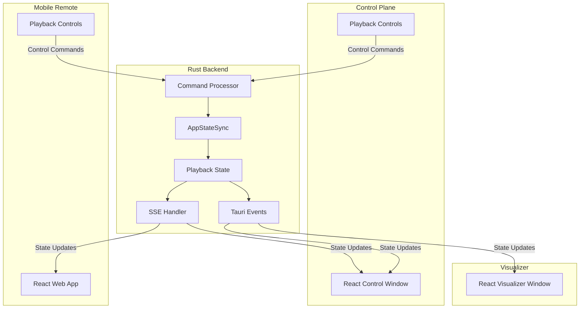

# Design Document: Message Control Synchronization

## Overview

The message control synchronization fix addresses the current limitation where message playback controls are not properly synchronized across all connected devices in Vibe Cast. The solution involves enhancing the existing state synchronization system to ensure that playback control commands (start/stop) initiated from any device are properly reflected and actionable on all connected devices.

The core issue stems from incomplete state propagation in the current hybrid SSE + Tauri Events architecture. When a message is started from a remote device, the control plane receives the playback state but lacks the necessary control context to enable stop functionality.

## Architecture

The solution builds upon Vibe Cast's existing architecture while enhancing the state synchronization mechanisms:



### State Flow Enhancement

The enhanced state synchronization ensures bidirectional control capability:

1. **Command Reception**: Any device can send start/stop commands
2. **Centralized Processing**: AppStateSync processes all commands as the single source of truth
3. **State Propagation**: Updated state is broadcast to all connected devices
4. **UI Synchronization**: All devices update their control interfaces based on the new state

## Components and Interfaces

### Enhanced AppStateSync

The core state management component requires enhancement to handle comprehensive playback control state:

```rust
#[derive(Clone, Debug, Serialize, Deserialize)]
pub struct PlaybackControlState {
    pub session_id: Option<String>,
    pub current_message: Option<MessageInfo>,
    pub is_playing: bool,
    pub playback_position: Duration,
    pub can_stop: bool,
    pub can_start: bool,
    pub initiated_by: DeviceType,
    pub last_updated: SystemTime,
}

#[derive(Clone, Debug, Serialize, Deserialize)]
pub struct MessageInfo {
    pub id: String,
    pub title: String,
    pub duration: Option<Duration>,
    pub folder_path: Option<String>,
}

#[derive(Clone, Debug, Serialize, Deserialize)]
pub enum DeviceType {
    ControlPlane,
    MobileRemote,
    System,
}
```

### Command Processing Interface

A standardized command interface ensures consistent processing across all device types:

```rust
#[derive(Clone, Debug, Serialize, Deserialize)]
pub enum PlaybackCommand {
    Start {
        message_id: String,
        device_id: String,
        timestamp: SystemTime,
    },
    Stop {
        device_id: String,
        timestamp: SystemTime,
    },
    Pause {
        device_id: String,
        timestamp: SystemTime,
    },
    Resume {
        device_id: String,
        timestamp: SystemTime,
    },
}

pub trait PlaybackController {
    async fn execute_command(&mut self, command: PlaybackCommand) -> Result<PlaybackControlState, PlaybackError>;
    async fn get_current_state(&self) -> PlaybackControlState;
    fn subscribe_to_changes(&self) -> Receiver<PlaybackControlState>;
}
```

### State Synchronization Enhancement

The existing SSE and Tauri Events system requires enhancement to carry complete control state:

```typescript
interface PlaybackControlState {
  sessionId: string | null;
  currentMessage: MessageInfo | null;
  isPlaying: boolean;
  playbackPosition: number; // milliseconds
  canStop: boolean;
  canStart: boolean;
  initiatedBy: DeviceType;
  lastUpdated: number; // timestamp
}

interface MessageInfo {
  id: string;
  title: string;
  duration?: number;
  folderPath?: string;
}

enum DeviceType {
  ControlPlane = 'control_plane',
  MobileRemote = 'mobile_remote',
  System = 'system'
}
```

### Frontend Control Components

Both Control Plane and Mobile Remote require enhanced control components that respond to the complete state:

```typescript
interface PlaybackControlProps {
  state: PlaybackControlState;
  onStart: (messageId: string) => void;
  onStop: () => void;
  onPause: () => void;
  onResume: () => void;
  deviceType: DeviceType;
}

const PlaybackControls: React.FC<PlaybackControlProps> = ({
  state,
  onStart,
  onStop,
  onPause,
  onResume,
  deviceType
}) => {
  // Render appropriate controls based on state.canStart, state.canStop, etc.
  // Ensure all devices show consistent control availability
};
```

## Data Models

### Playback Session Model

The playback session model captures the complete state of an active or inactive playback session:

```rust
#[derive(Clone, Debug, Serialize, Deserialize)]
pub struct PlaybackSession {
    pub id: String,
    pub message: MessageInfo,
    pub state: SessionState,
    pub started_at: SystemTime,
    pub started_by: DeviceType,
    pub current_position: Duration,
    pub total_duration: Option<Duration>,
    pub connected_devices: Vec<ConnectedDevice>,
}

#[derive(Clone, Debug, Serialize, Deserialize)]
pub enum SessionState {
    Playing,
    Paused,
    Stopped,
    Buffering,
    Error(String),
}

#[derive(Clone, Debug, Serialize, Deserialize)]
pub struct ConnectedDevice {
    pub id: String,
    pub device_type: DeviceType,
    pub last_seen: SystemTime,
    pub sync_status: SyncStatus,
}

#[derive(Clone, Debug, Serialize, Deserialize)]
pub enum SyncStatus {
    Synchronized,
    Pending,
    Failed(String),
}
```

### Command Queue Model

To handle concurrent commands and ensure proper ordering:

```rust
#[derive(Clone, Debug)]
pub struct CommandQueue {
    pub pending_commands: VecDeque<QueuedCommand>,
    pub processing: Option<QueuedCommand>,
    pub last_processed: Option<SystemTime>,
}

#[derive(Clone, Debug)]
pub struct QueuedCommand {
    pub id: String,
    pub command: PlaybackCommand,
    pub queued_at: SystemTime,
    pub retry_count: u32,
    pub max_retries: u32,
}
```

## Error Handling

### Error Types

Comprehensive error handling for all synchronization scenarios:

```rust
#[derive(Debug, Clone, Serialize, Deserialize)]
pub enum PlaybackError {
    MessageNotFound(String),
    InvalidCommand(String),
    StateCorruption(String),
    SyncFailure {
        device_id: String,
        error: String,
        retry_count: u32,
    },
    ConcurrentModification {
        expected_version: u64,
        actual_version: u64,
    },
    NetworkError(String),
    DeviceDisconnected(String),
}
```

### Recovery Strategies

1. **Command Retry Logic**: Failed commands are retried up to 3 times with exponential backoff
2. **State Reconciliation**: Periodic state reconciliation ensures all devices eventually converge
3. **Graceful Degradation**: Individual device sync failures don't affect overall system operation
4. **Persistent State**: Critical playback state is persisted to handle service restarts

### Error Propagation

Errors are handled at multiple levels:
- **Command Level**: Invalid commands are rejected with descriptive errors
- **Sync Level**: Sync failures trigger retry mechanisms
- **UI Level**: Users receive appropriate feedback for actionable errors

## Testing Strategy

The testing strategy employs both unit tests and property-based tests to ensure comprehensive coverage of the synchronization system.

**Unit Testing Focus:**
- Specific command processing scenarios
- Error condition handling
- State transition validation
- Integration between components
- Edge cases like rapid command sequences

**Property-Based Testing Focus:**
- Universal properties that must hold across all valid inputs
- State consistency across multiple devices
- Command processing correctness
- Synchronization behavior under various network conditions

**Testing Configuration:**
- Property tests will run a minimum of 100 iterations to ensure comprehensive input coverage
- Each property test will be tagged with: **Feature: message-control-sync, Property {number}: {property_text}**
- Tests will use appropriate property-based testing libraries for both Rust (proptest) and TypeScript (fast-check)
- Both unit and property tests are complementary and necessary for complete validation

## Correctness Properties

*A property is a characteristic or behavior that should hold true across all valid executions of a system—essentially, a formal statement about what the system should do. Properties serve as the bridge between human-readable specifications and machine-verifiable correctness guarantees.*

Based on the requirements analysis, the following properties must hold for the message control synchronization system:

### Property 1: Bidirectional Control Consistency
*For any* device (Control Plane or Mobile Remote) and any valid message, when that device starts the message, all other connected devices should display both the playing state and stop control functionality.
**Validates: Requirements 1.1, 1.2**

### Property 2: Universal Stop Control
*For any* device and any active playback session, when that device sends a stop command, the system should immediately halt playback and update all connected devices to show the stopped state.
**Validates: Requirements 1.3**

### Property 3: UI State Consistency
*For any* system state (playing or idle) and any set of connected devices, all devices should display consistent control interfaces that accurately reflect the current playback capabilities.
**Validates: Requirements 1.4, 1.5, 4.1, 4.2, 4.3, 4.4**

### Property 4: State Propagation Timing
*For any* state change initiated from any device, all connected devices should receive and reflect the updated state within 100ms.
**Validates: Requirements 2.1, 4.5**

### Property 5: Command Processing Order
*For any* control command received by AppStateSync, the authoritative state should be updated before any acknowledgment is sent to the requesting device.
**Validates: Requirements 2.2**

### Property 6: New Device Synchronization
*For any* device connecting to an active playback session, that device should immediately receive and display the current playback state.
**Validates: Requirements 2.3**

### Property 7: Network Resilience
*For any* temporary network disconnection, state changes should be queued and synchronized when connectivity is restored, maintaining eventual consistency.
**Validates: Requirements 2.4**

### Property 8: Concurrent Command Consistency
*For any* set of conflicting commands sent simultaneously from multiple devices, AppStateSync should process them in a deterministic order and maintain state consistency.
**Validates: Requirements 2.5**

### Property 9: Command Validation
*For any* start command with a message ID, the system should validate the message exists before updating playback state, rejecting invalid messages without state changes.
**Validates: Requirements 3.1**

### Property 10: Stop Command Completeness
*For any* active playback session, a stop command should immediately clear both the playback state and the active session state.
**Validates: Requirements 3.2**

### Property 11: State Broadcast Consistency
*For any* successfully processed control command, the resulting state change should be broadcast to all connected devices via the State_Sync mechanism.
**Validates: Requirements 3.4**

### Property 12: Command Idempotency
*For any* control command sent multiple times in rapid succession, the system should handle it idempotently without state corruption.
**Validates: Requirements 3.5**

### Property 13: Error Isolation
*For any* invalid or malformed command from any device, the system should reject it gracefully without affecting the current state or other connected devices.
**Validates: Requirements 3.3, 5.4**

### Property 14: Disconnection Resilience
*For any* device disconnection during active playback, the system should continue playback and resynchronize the device when it reconnects.
**Validates: Requirements 5.1**

### Property 15: Error State Preservation
*For any* error encountered during command processing, the system should log the error and maintain the previous valid state.
**Validates: Requirements 5.2**

### Property 16: Sync Retry Logic
*For any* state synchronization failure to a specific device, the system should retry the sync operation up to 3 times before marking the sync as failed.
**Validates: Requirements 5.3**

### Property 17: Service Recovery
*For any* backend service restart during active playback, the system should restore the playback state from persistent storage when available.
**Validates: Requirements 5.5**