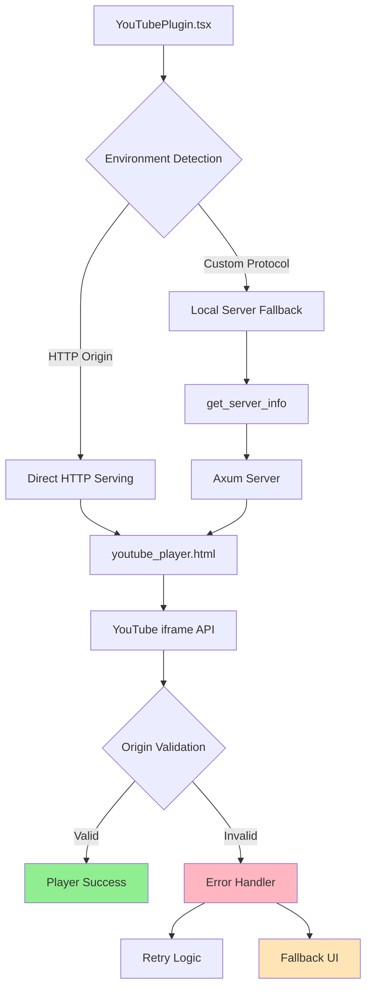

# Design Document: YouTube Player Production Fix

## Overview

The YouTube player component in VibeCast currently fails in production mode due to origin validation issues with YouTube's iframe API. This design addresses the root causes and implements a robust, multi-layered solution that ensures reliable YouTube player functionality across all deployment scenarios.

The core issue stems from the difference between development and production asset serving:
- **Development**: Assets served via Vite dev server (`http://localhost:1420`) with standard HTTP origins
- **Production**: Assets served via Tauri's custom protocol (`tauri://` or `asset://`) which YouTube's iframe API doesn't recognize as valid origins

## Architecture

### Current Architecture Analysis

The existing implementation uses a hybrid approach:
1. **YouTubePlugin.tsx** creates an iframe pointing to `/youtube_player.html`
2. **Server Detection Logic** determines the appropriate server URL:
   - HTTP protocols (dev/web remote): Use current origin
   - Custom protocols (production): Call `get_server_info` to get local Axum server port
3. **youtube_player.html** loads YouTube's iframe API and creates a YT.Player instance
4. **Axum Server** serves the HTML file via `ServeFile` route

### Root Cause Analysis

The production failure occurs because:
1. **Origin Mismatch**: YouTube's iframe API validates the `origin` parameter against the actual document origin
2. **CSP Null Configuration**: Current CSP is set to `null`, which may cause restrictive default policies
3. **Asset Protocol Limitations**: Tauri's custom protocols aren't recognized by YouTube as valid web origins
4. **Fallback Gaps**: No robust error handling when the local server approach fails

### Proposed Architecture



## Components and Interfaces

### 1. Enhanced YouTubePlugin Component

**Responsibilities:**
- Environment detection and server URL resolution
- Iframe lifecycle management with error handling
- Retry logic with exponential backoff
- Fallback UI rendering

**Key Interfaces:**
```typescript
interface YouTubePlayerState {
  serverUrl: string | null;
  error: string | null;
  retryCount: number;
  isRetrying: boolean;
}

interface ServerInfo {
  ip: string;
  port: number;
}

interface YouTubePlayerConfig {
  maxRetries: number;
  retryDelayMs: number;
  timeoutMs: number;
}
```

### 2. Enhanced Asset Serving Strategy

**Primary Method: Tauri Asset Protocol**
- Serve `youtube_player.html` directly via Tauri's asset protocol
- Configure proper MIME types and headers
- Handle origin parameter correctly for YouTube API

**Fallback Method: Local HTTP Server**
- Use existing Axum server as backup
- Ensure proper CORS headers for YouTube API compatibility
- Validate server availability before iframe creation

**Validation Layer:**
- Pre-flight checks for asset availability
- Server health validation
- Origin compatibility testing

### 3. YouTube Player HTML Enhancements

**Origin Handling:**
```javascript
// Dynamic origin detection with fallbacks
function getValidOrigin() {
  const origins = [
    window.location.origin,
    'http://localhost:' + getPortFromUrl(),
    'https://localhost:' + getPortFromUrl(),
    null // Let YouTube determine
  ];
  return origins.find(origin => origin && isValidOrigin(origin));
}
```

**Error Recovery:**
- Comprehensive error event handling
- Automatic retry mechanisms
- Detailed error reporting to parent frame

**API Loading Robustness:**
```javascript
// Enhanced API loading with timeout and retry
function loadYouTubeAPI() {
  return new Promise((resolve, reject) => {
    const timeout = setTimeout(() => {
      reject(new Error('YouTube API load timeout'));
    }, 10000);
    
    if (window.YT && window.YT.Player) {
      clearTimeout(timeout);
      resolve(window.YT);
      return;
    }
    
    window.onYouTubeIframeAPIReady = () => {
      clearTimeout(timeout);
      resolve(window.YT);
    };
  });
}
```

### 4. Configuration Management

**CSP Configuration:**
```json
{
  "security": {
    "csp": {
      "default-src": "'self' tauri:",
      "script-src": "'self' 'unsafe-inline' https://www.youtube.com https://www.gstatic.com",
      "frame-src": "'self' https://www.youtube.com https://www.youtube-nocookie.com",
      "connect-src": "'self' https://www.youtube.com https://googlevideo.com",
      "img-src": "'self' data: https://i.ytimg.com https://yt3.ggpht.com"
    }
  }
}
```

**Runtime Configuration:**
```typescript
interface YouTubeConfig {
  retryAttempts: number;
  retryDelayMs: number;
  timeoutMs: number;
  fallbackEnabled: boolean;
  debugMode: boolean;
}
```

## Data Models

### Error State Management

```typescript
enum YouTubeErrorType {
  NETWORK_ERROR = 'network_error',
  ORIGIN_REJECTED = 'origin_rejected',
  API_LOAD_FAILED = 'api_load_failed',
  PLAYER_INIT_FAILED = 'player_init_failed',
  SERVER_UNAVAILABLE = 'server_unavailable',
  CSP_BLOCKED = 'csp_blocked'
}

interface YouTubeError {
  type: YouTubeErrorType;
  message: string;
  details?: any;
  timestamp: number;
  retryable: boolean;
}
```

### Player State Model

```typescript
interface YouTubePlayerState {
  status: 'loading' | 'ready' | 'error' | 'fallback';
  player: YT.Player | null;
  error: YouTubeError | null;
  config: YouTubeConfig;
  serverInfo: ServerInfo | null;
}
```

## Correctness Properties

*A property is a characteristic or behavior that should hold true across all valid executions of a system-essentially, a formal statement about what the system should do. Properties serve as the bridge between human-readable specifications and machine-verifiable correctness guarantees.*

### Property Reflection

After analyzing all acceptance criteria, several properties can be consolidated to eliminate redundancy:

- **Origin handling properties** (2.1, 2.2, 2.4, 2.5) → Combined into comprehensive origin validation
- **Error handling properties** (5.1, 5.2, 5.3, 5.4) → Consolidated into error handling and logging
- **Fallback properties** (6.1, 6.2, 6.3, 6.4, 6.5) → Combined into graceful degradation behavior
- **Configuration properties** (8.1, 8.2, 8.4, 8.5) → Consolidated into configuration validation
- **Asset serving properties** (4.1, 4.2, 4.3, 4.4) → Combined into serving strategy validation

### Correctness Properties

**Property 1: YouTube API Loading Reliability**
*For any* environment (development or production), when the YouTube player component initializes, the YouTube iframe API should load successfully within the configured timeout period or trigger appropriate retry mechanisms with exponential backoff.
**Validates: Requirements 1.1, 1.2, 1.3, 1.4**

**Property 2: Player Initialization and Communication**
*For any* successful YouTube API load, the player should initialize correctly and emit ready events to the parent application, enabling proper communication between iframe and parent components.
**Validates: Requirements 1.5**

**Property 3: Origin Validation and Compatibility**
*For any* deployment environment, the YouTube player should provide origins that YouTube's iframe API accepts, and when origins are rejected, should automatically attempt alternative serving methods until a compatible configuration is found.
**Validates: Requirements 2.1, 2.2, 2.3, 2.4, 2.5**

**Property 4: Asset Serving Strategy Robustness**
*For any* asset serving attempt, the system should try the primary method (Tauri asset protocol in production), and if that fails, should automatically fallback to HTTP server method with proper MIME types and headers, validating accessibility before iframe creation.
**Validates: Requirements 4.1, 4.2, 4.3, 4.4, 4.5**

**Property 5: Comprehensive Error Handling and Logging**
*For any* error condition (network issues, CSP blocks, API failures), the YouTube player should detect the specific issue type, log detailed information for debugging, display user-friendly messages, and provide retry mechanisms where appropriate.
**Validates: Requirements 5.1, 5.2, 5.3, 5.4, 5.5**

**Property 6: Graceful Degradation and Fallback Behavior**
*For any* scenario where YouTube functionality is unavailable or blocked, the player should gracefully degrade by displaying fallback interfaces, offering manual URL input, providing alternative suggestions, and clearly indicating reduced functionality without breaking core application usability.
**Validates: Requirements 6.1, 6.2, 6.3, 6.4, 6.5**

**Property 7: Configuration Validation and Defaults**
*For any* configuration input (retry attempts, timeouts, fallback preferences), the system should validate parameters at startup, use safe default values for invalid configurations, and log any configuration issues while respecting environment-specific settings.
**Validates: Requirements 8.1, 8.2, 8.3, 8.4, 8.5**

**Property 8: CSP Compliance and Resource Access**
*For any* YouTube resource loading attempt, the system should respect CSP policies while ensuring YouTube functionality, log detailed errors when CSP blocks resources, and maintain security for non-YouTube resources.
**Validates: Requirements 3.4, 3.5**

## Error Handling

### Error Classification System

The system implements a comprehensive error classification to enable appropriate handling strategies:

```typescript
enum YouTubeErrorType {
  // Network-related errors
  NETWORK_TIMEOUT = 'network_timeout',
  NETWORK_UNREACHABLE = 'network_unreachable',
  
  // Origin and CORS errors
  ORIGIN_REJECTED = 'origin_rejected',
  CORS_BLOCKED = 'cors_blocked',
  
  // API and loading errors
  API_LOAD_TIMEOUT = 'api_load_timeout',
  API_SCRIPT_BLOCKED = 'api_script_blocked',
  PLAYER_INIT_FAILED = 'player_init_failed',
  
  // Server and asset errors
  SERVER_UNAVAILABLE = 'server_unavailable',
  ASSET_NOT_FOUND = 'asset_not_found',
  
  // Security policy errors
  CSP_SCRIPT_BLOCKED = 'csp_script_blocked',
  CSP_FRAME_BLOCKED = 'csp_frame_blocked',
  
  // Configuration errors
  INVALID_CONFIG = 'invalid_config',
  INVALID_VIDEO_ID = 'invalid_video_id'
}
```

### Error Recovery Strategies

**Automatic Recovery:**
- Network timeouts: Exponential backoff retry (1s, 2s, 4s, 8s, 16s)
- Origin rejection: Try alternative origins and serving methods
- Server unavailable: Fallback to asset protocol or alternative ports

**User-Assisted Recovery:**
- Invalid video URLs: Provide format validation and examples
- CSP blocks: Display actionable instructions for policy adjustment
- Complete API failure: Offer manual URL input and external player links

**Graceful Degradation:**
- Show informative placeholder when YouTube is completely unavailable
- Maintain visualization plugin functionality with static content
- Preserve application stability regardless of YouTube player state

### Logging and Diagnostics

**Error Context Collection:**
```typescript
interface ErrorContext {
  timestamp: number;
  environment: 'development' | 'production';
  protocol: string;
  origin: string;
  serverInfo: ServerInfo | null;
  userAgent: string;
  retryAttempt: number;
  previousErrors: YouTubeError[];
}
```

**Diagnostic Information:**
- Network connectivity status
- CSP policy evaluation results
- Server availability and response times
- YouTube API script loading status
- Browser compatibility indicators

## Testing Strategy

### Dual Testing Approach

The testing strategy employs both unit tests and property-based tests to ensure comprehensive coverage:

**Unit Tests** focus on:
- Specific error scenarios and edge cases
- Integration points between components
- Configuration validation with known invalid inputs
- CSP policy compliance with specific resource URLs
- Fallback UI rendering in known failure states

**Property-Based Tests** focus on:
- Universal properties that hold across all inputs and environments
- Comprehensive input coverage through randomization
- Behavioral consistency across different deployment scenarios
- Error handling robustness with generated failure conditions

### Property-Based Testing Configuration

The implementation uses **Vitest** with **fast-check** for property-based testing:

- **Minimum 100 iterations** per property test to ensure statistical confidence
- **Custom generators** for YouTube URLs, server configurations, and error conditions
- **Environment simulation** to test both development and production scenarios
- **Tag format**: `Feature: youtube-player-production-fix, Property {number}: {property_text}`

### Test Environment Setup

**Production Simulation:**
```typescript
// Simulate production environment for testing
const mockProductionEnvironment = () => ({
  protocol: 'tauri:',
  origin: 'tauri://localhost',
  assetProtocol: true,
  csp: productionCSPPolicy
});
```

**Network Condition Simulation:**
```typescript
// Test various network conditions
const networkConditions = [
  'online',
  'offline', 
  'slow-connection',
  'youtube-blocked',
  'partial-connectivity'
];
```

**Error Injection Framework:**
```typescript
// Systematic error injection for testing
interface ErrorInjection {
  type: YouTubeErrorType;
  timing: 'immediate' | 'delayed' | 'random';
  recovery: boolean;
}
```

### Integration Testing

**Cross-Environment Validation:**
- Test identical functionality across development and production builds
- Validate server fallback mechanisms work in both Tauri and web contexts
- Ensure CSP policies don't break functionality in any deployment scenario

**End-to-End Scenarios:**
- Complete YouTube player lifecycle from initialization to video playback
- Error recovery flows from detection through user notification
- Configuration changes and their effects on player behavior

### Regression Prevention

**Automated Production Testing:**
- CI/CD pipeline includes production build testing
- Automated detection of YouTube API compatibility issues
- Performance regression testing for asset loading times

**Compatibility Monitoring:**
- YouTube API version compatibility tracking
- Browser compatibility validation across supported platforms
- Tauri version compatibility verification

The testing strategy ensures that YouTube player functionality remains robust across all deployment scenarios while preventing regressions that could affect production users.