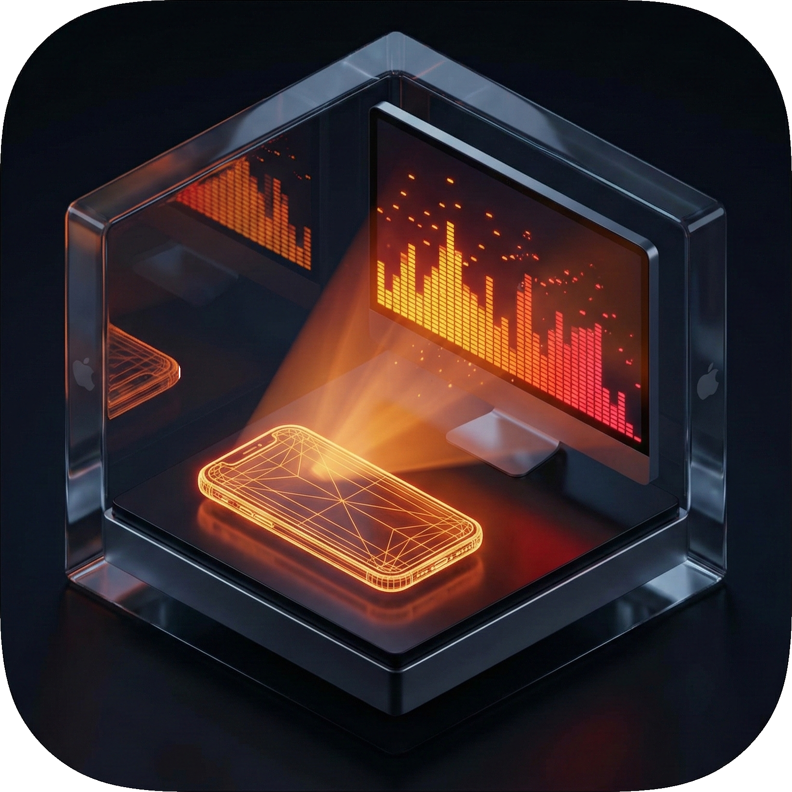
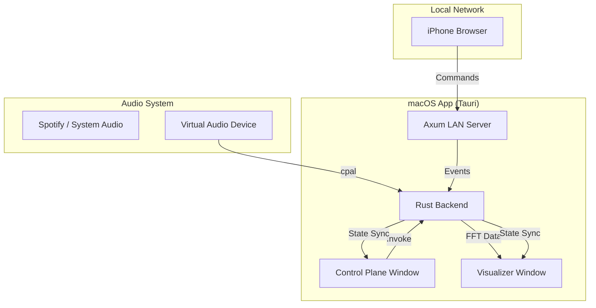

# Vibe Cast

<div align="center">
  
</div>

A fully vibe-coded application
built with **Tauri v2** and **React**. Designed for  visualizations on secondary displays (like Apple TV via AirPlay) with remote control capabilities from an iPhone.

> [!WARNING] 
> This application has only been vibe-coded and developed 
> for a single use-case, it is not meant for general usage 
> nor has it been tested or audited. It has a lot of bugs, no 
> documentation and several known crashes.

## 🚀 Features

- **Dual Window Setup**:
  - **Control Plane**: A management interface for the main monitor.
  - **Visualizer**: A dedicated, borderless window for the secondary display.
- **Immersive Visualizations**:
  - **Fireplace**: A calm, procedurally animated fireplace with configurable flames, embers, and glow.
  - **Techno**: A dynamic, audio-reactive 3D environment built with React Three Fiber with customizable sphere and frequency bars.
  - **Waves**: Flowing audio-reactive wave patterns for a calming, ocean-like visualization.
  - **Particles**: Dynamic particle system with customizable colors and spread.
  - **YouTube**: Loop YouTube videos with Premium account support for ad-free playback. [Documentation](docs/YOUTUBE_PLUGIN.md)
  - **Photo Slideshow**: Display images from local folders or Apple Photos with smooth transitions. [Documentation](docs/PHOTO_SLIDESHOW_PLUGIN.md)
- **Audio Reactivity**: Real-time FFT analysis of system audio (e.g., Spotify) using Rust.
- **iPhone Remote**: A web-based remote control served over the LAN, accessible via QR code.
- **Text Message Styles**: Multiple text display styles with full customization:
  - **Scrolling Capitals**: Large uppercase text scrolling across the screen (classic marquee).
  - **Fade**: Centered text that fades in and out with customizable timing and styling.
  - **Typewriter**: Character-by-character typing effect with blinking cursor.
  - **Bounce**: Playful bounce-in animation with glow effects.
  - **Credits**: Movie-style vertical scrolling credits, perfect for loading from files.
- **Message Management**: Create, reorder, and remove preset messages. Multiple messages can display simultaneously.
  - **File Loading**: Load message text from external files for long content. [Documentation](docs/FILE_LOADING.md)
- **Visualization Selection**: Choose which visualizations appear as quick-access buttons.
- **Comprehensive Settings**: Per-visualization and per-text-style settings with real-time preview.

## 📚 Documentation

- [Architecture](docs/ARCHITECTURE.md) - System design and data flow.
- [Changelog](docs/CHANGELOG.md) - History of changes and fixes.
- **Feature Guides**:
  - [Photo Slideshow Plugin](docs/PHOTO_SLIDESHOW_PLUGIN.md)
  - [YouTube Plugin](docs/YOUTUBE_PLUGIN.md)
  - [File Loading & Relative Paths](docs/FILE_LOADING.md)

## 🏗️ Architecture

The application follows a distributed architecture combining a native Rust core with a React-based frontend.

### System Diagram



### Backend (Rust)
- **Window Management**: Orchestrates multiple windows and ensures the Visualizer window is optimized for secondary displays.
- **Audio Engine**: Uses `cpal` to capture audio from a loopback device and `realfft` to provide frequency data to the frontend at 60fps.
- **LAN Server**: An integrated `axum` server that serves the mobile remote UI to devices on the same Wi-Fi network.
- **State Synchronization**: Maintains shared application state (`AppStateSync`) for mode and messages, exposed via REST API for the mobile remote.

### Frontend (React)
- **Zustand Store**: Per-window state management synchronized via Tauri events for mode switching, message queues, and audio data.
- **React Three Fiber**: Powers the high-performance 3D techno visualizations.
- **Framer Motion**: Handles the smooth rolling message animations.

## 🛠️ Tech Stack

- **Framework**: Tauri v2
- **Frontend**: React, TypeScript, Vite, Tailwind CSS
- **3D/Animation**: React Three Fiber, Three.js, Framer Motion
- **Backend**: Rust (cpal, axum, tokio, realfft)
- **State**: Zustand

## 🚦 Getting Started

### Prerequisites
1.  **Rust**: [Install Rust](https://www.rust-lang.org/tools/install)
2.  **Node.js**: [Install Node.js](https://nodejs.org/)
3.  **Audio Loopback (macOS)**: To capture system audio (like Spotify), you need a virtual audio device.
    -   Recommended: [BlackHole](https://github.com/ExistentialAudio/BlackHole)
    -   Setup: Create a "Multi-Output Device" in Audio MIDI Setup that includes your speakers/AirPlay and BlackHole.

### Installation
```bash
# Clone the repository
# ...

# Install dependencies
npm install
```

### Development
```bash
# Start the app in development mode
npm run tauri dev
```

### Building for Production
```bash
# Build the production bundle
npm run tauri build
```

## 📱 Usage
1.  Launch the app on your Mac.
2.  If using AirPlay, move the **Visualizer** window to your secondary display.
3.  Scan the QR code displayed in the **Control Plane** using your iPhone.
4.  Use the remote to toggle between **Fireplace** and **Techno** modes, or trigger scrolling messages.
